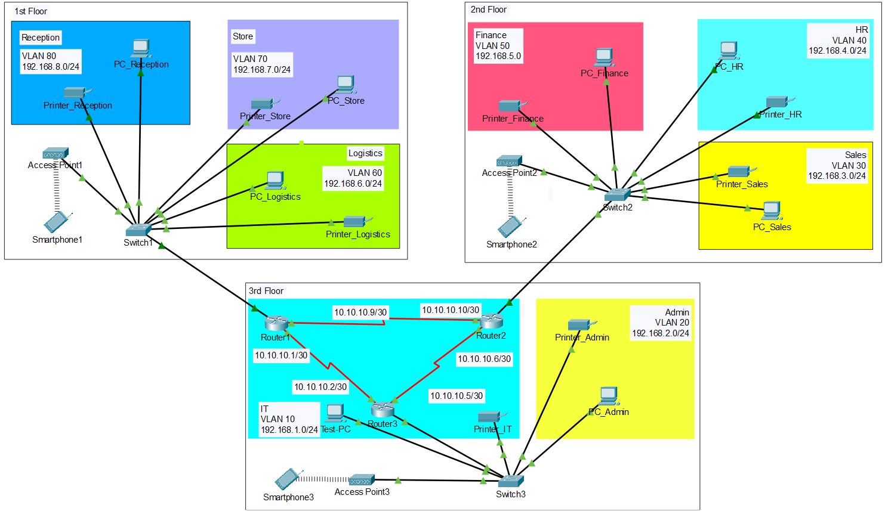
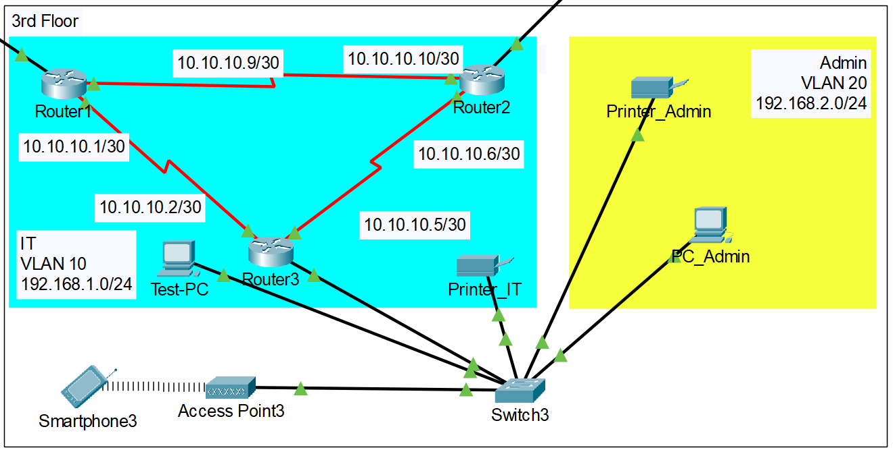
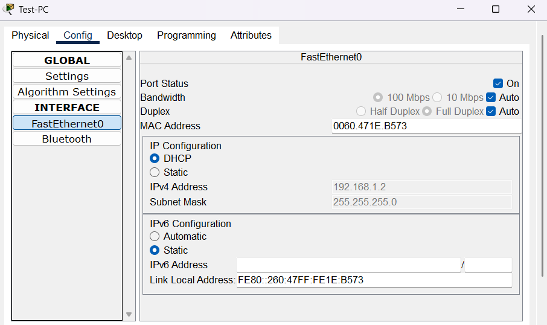
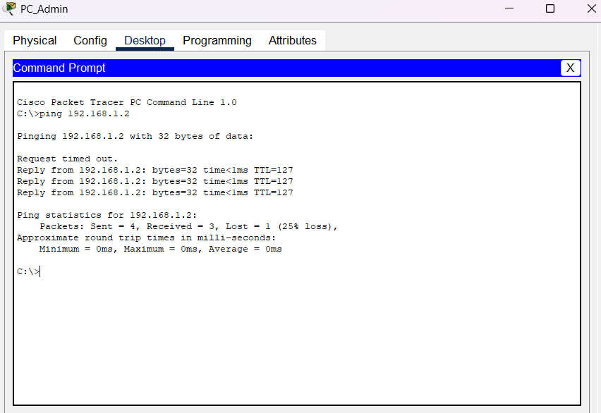
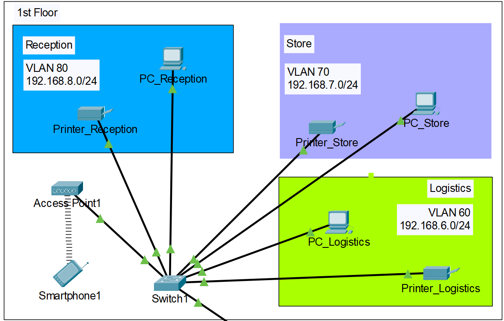

# HOTEL NETWORK PROJECT

## DESCRIPTION

You are required to design and implement a Vic Modern Hotel network. The hotel has three floors; in the first floor there are three departments(Reception, store and Logistics), in the second floor there are three departments(Finance, HR and Sales/Marketing), while the third floor hosts the IT and Admin. Therefore, the following are part of the considerations during the design and implementation.

1. There should be three routers connecting each floor(all placed in the server room in IT department).
2. All routers should be connected to each other using serial DCE cable.
3. The network between the routers should be 10.10.10.0/30, 10.10.10.4/30, 10.10.10.9/30
4. Each floor is expected to have one switch (placed in the respective floor).
5. Each floor is expected to have WIFI networks connected to laptops and phones.
6. Each departmente is expected to have a printer.
7. Each department is expected to be in different VLAN with the following details:

      1st Floor:<br>
           • Reception - VLAN 80, Network of 192.168.8.0/24<br>
           • Store - VLAN 70, Network of 192.168.7.0/24<br>
           • Logistics - VLAN 60, Network of 192.168.6.0/24<br>

      2nd Floor:<br>
           • Finance - VLAN 50, Network of 192.168.5.0/24<br>
           • HR - VLAN 40, Network of 192.168.4.0/24<br>
           • Sales - VLAN 30, Network of 192.168.3.0/24<br>

      3rd Floor:<br>
           • Admin - VLAN 20, Network of 192.168.2.0/24<br>
           • IT - VLAN 10, Network of 192.168.1.0/24<br>

9. Use OSPF as the routing protocol to advertise routes.
10. All devices in the network are expected to obtain IP address dynamically with their respective router configured as the DHCP server.
11. All the devices in the network are expected to communicate with each other.
12. Configure SSH in all the routers for remote login.
13. In IT department, add PC called Test-PC to port fa0/1 and use it to test remote login.
<br>

## SOLUTION

The following image presents the whole hotel network design grouped in different floors, in a Cisco Packet Tracer schema.



Since requirements 1-3 refer to the 3rd floor and specifically the IT department, I will start the configuration from there.

### 3RD FLOOR

<p align="center">  </p>

The 3rd Floor is consisted of the IT and the Admin departments.
In the IT department I will add 3 Cisco ISR 4321 routers connected with serial DCE cables to meet the requirements 1 and 2. On the 3rd requirement I am given 3 networks to use between the routers.

The first network is 10.10.10.0/30, which corresponds to the address range 10.10.10.0 - 10.10.10.3. 
However, 10.10.10.0 and 10.10.10.3 need to be reserved as network and broadcast addresses respectively. So,
- Router1 - Router3:<br>
10.10.10.0 -> Network <br>
10.10.10.1 -> R1 interface Serial 0/1/0<br>
10.10.10.2 -> R3 interface Serial 0/1/0<br>
10.10.10.3 -> Broadcast

The second network is 10.10.10.4/30, so that leaves us with address range 10.10.10.4 - 10.10.10.7. So, in the same way:
- Router2 - Router3:<br>
10.10.10.4 -> Network <br>
10.10.10.5 -> R3 interface Serial 0/1/1<br>
10.10.10.6 -> R2 interface SErial 0/1/1<br>
10.10.10.7 -> Broadcast

The third network is 10.10.10.8/30, so the available address range is 10.10.10.8 - 10.10.10.11 and once again:
- Router1 - Router2:<br>
10.10.10.8 -> Network <br>
10.10.10.9 -> R1 interface Serial 0/1/1<br>
10.10.10.10 -> R2 interface Serial 0/1/0<br>
10.10.10.11 -> Broadcast

After the address assignment on the routers, I will work on the rest of the configuration on the 3rd floor.

Each floor is supposed to have WIFI network for wireless devices and each department should be given a printer. I will also add a PC to every department for troubleshooting perposes and a Cisco 2960 IOS 15 switch to connect the 3rd floor's devices with each other and with the Router 3 as well.

Let's now jump over to the VLAN configuration of the 3rd floor.

On Switch3, once I get to the configuration terminal, I'll create the VLANs 10 and 20 which correspond to the IT and Admin departments respectively.

 
```
Switch3(config)# vlan 10
Switch3(config-vlan)# name IT
Switch3(config-vlan)# exit

Switch3(config)# vlan 20
Switch3(config-vlan)# name Admin
Switch3(config-vlan)# exit
```

Now I need to specify the ports of each VLAN and make them access ports if they lead to end devices. 
IT VLAN has the Test_PC and the Printer_IT on ports Fa0/1 and Fa0/3. So:

```
Switch3(config)# int range fa0/1, fa0/3
Switch3(config-if-range)# switchport mode access
Switch3(config-if-range)# switchport access vlan 10
Switch3(config-if-range)# exit
```

Admin VLAN has the PC_Admin and the Printer_Admin on ports Fa0/2 and Fa0/4. So:
```
Switch3(config)# int range fa0/2, fa0/4
Switch3(config-if-range)# switchport mode access
Switch3(config-if-range)# switchport access vlan 20
Switch3(config-if-range)# exit
```
Requirement 10 states that all devices in the hotel network should communicate with each other. In this case I need to set up inter-vlan routing using the router-on-a-stick design to allow comunication between different VLANs. Prior to that though, I 'll enable trunking on Switch3's interface G0/1 that connects it to the Router3.

```
int g0/1
switchport mode trunk
switchport trunk allowed vlan 10,20
```

Now on Router3 I'll configure router-on-a-stick design, using encapsulation, in order to split the interface G0/0/0 and create 2 different virtual gateway addresses, one for each VLAN.
For all VLANs, I will be setting the first available address, after the network, to be the virtual gateway.

```
Router3(config)# int g0/0/0.10
Router3(config-subif)# encapsulation dot1Q 10
Router3(config-subif)# ip address 192.168.1.1 255.255.255.0
Router3(config-subif)# exit
```
```
Router3(config)# int g0/0/0.20
Router3(config-subif)# encapsulation dot1Q 20
Router3(config-subif)# ip address 192.168.2.1 255.255.255.0
Router3(config-subif)# exit
```

3rd floor VLAN configuration is almost ready, however without ip addresses, no communication is going to work. Requirement 9 states that all devices are supposed to get IP addresses dynamically, using DHCP. In this case, I will set the routers to be the DHCP servers. On Router3 I'll create one DHCP pool for each VLAN, then I'll specify the default gateway and the dns server of each pool.

For the IT VLAN:
```
Router3(config)# ip dhcp pool IT
Router3(dhcp-config)# network 192.168.1.0 255.255.255.0
Router3(dhcp-config)# default-router 192.168.1.1
Router3(dhcp-config)# dns-server 192.168.1.1
Router3(dhcp-config)# exit
```

For the Admin VLAN:
```
Router3(config)# ip dhcp pool Admin
Router3(dhcp-config)# network 192.168.2.0 255.255.255.0
Router3(dhcp-config)# default-router 192.168.2.1
Router3(dhcp-config)# dns-server 192.168.2.1
Router3(dhcp-config)# exit
```

Now, using the GUI that Packet Tracer provides for Printers and PCs, I'll enable the DHCP option for the IP configuration. As we can see, Test_PC has obtained IP address 192.168.1.2, which is a valid one within the 192.168.1.0/24 address space.

<p align="center">  </p>

The same applies for the other end devices on the 3rd floor, except for the Smartphone3, which uses WiFi for communication. I will leave this configuration for later.
<br>It is also a nice practice to test the communication every now and then to make sure everything works as supposed to. So I'll try to ping Test_PC from The PC_Admin to test if the inter-vlan-routing configuration is correct.

<p align="center">  </p>

Thankfully, we get a reply on the ping request. Now I can proceed in the configuration of the other floors.

### 1ST FLOOR

<p align="center">  </p>

The 1st floor is consisted of the Reception, Store and Logistics departments, each one including a printer and a PC. Also I'll place another Cisco 2960 IOS 15 switch, an access point and a smartphone as a wireless device.

Once again I will create one VLAN for each department on the 1st floor.

```
Switch1(config)# vlan 80
Switch1(config-vlan)# name Reception
Switch1(config-vlan)# exit

Switch1(config)# vlan 70
Switch1(config-vlan)# name Store
Switch1(config-vlan)# exit

Switch1(config)# vlan 60
Switch1(conf-vlan)# name Logistics
Switch1(conf-vlan)# exit
```

Interfaces Fa0/1 and Fa0/4 belong to VLAN Reception, Fa0/2 and Fa0/5 to VLAN Store, Fa0/3 and Fa0/6 belong to VLAN Logistics. All of these interfaces lead to end devices so the need to be configured into access ports. 

```
Switch1(config)# int range fa0/1, fa0/4
Switch1(config-if-range)# switchport mode access
Switch1(config-if-range)# switchport access vlan 80
Switch1(config-if-range)# exit
